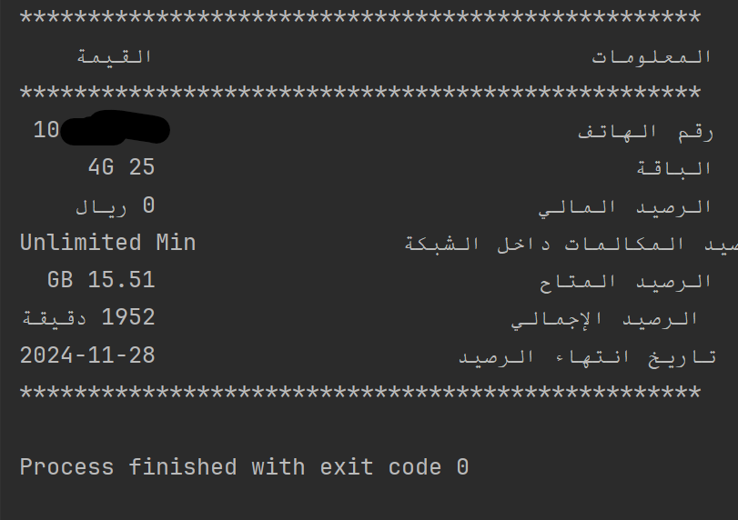

# مشروع تخطي التحقق CAPTCHA

هذا المشروع مخصص لتخطي التحقق CAPTCHA في موقع [ptc.gov.ye]. 

**ملاحظة هامة:**  
هذا الكود مُعَد لأغراض تعليمية فقط، صاحب الكود غير مسؤول عن أي محاولة إساءة أو استخدام غير قانوني لهذا الكود، يُرجى استخدامه بما يتوافق مع القوانين واللوائح المحلية.

# المتطلبات

يمكنك تثبيت المتطلبات التالية بسهولة باستخدام `pip`:

- `beautifulsoup4==4.12.3`
- `easyocr==1.7.2`
- `numpy==2.1.3`
- `opencv_contrib_python==4.10.0.84`
- `opencv_python==4.10.0.84`
- `opencv_python_headless==4.10.0.84`
- `Requests==2.32.3`

# كيفية تثبيت المتطلبات

لتثبيت جميع المتطلبات دفعة واحدة، يمكنك استخدام الأمر التالي:

```bash
pip install beautifulsoup4==4.12.3 easyocr==1.7.2 numpy==2.1.3 opencv_contrib_python==4.10.0.84 opencv_python==4.10.0.84 opencv_python_headless==4.10.0.84 Requests==2.32.3
```

# كيفية الاستخدام


ابحث عن السطر التالي:
```
self.yemen4G_number = '123456789'
```
قم بتغيير الرقم '123456789' إلى رقم الهاتف الخاص بك.


## مخرجات البرنامج
فيما يلي صورة توضح شكل المخرجات الناتجة عن تشغيل الكود:



